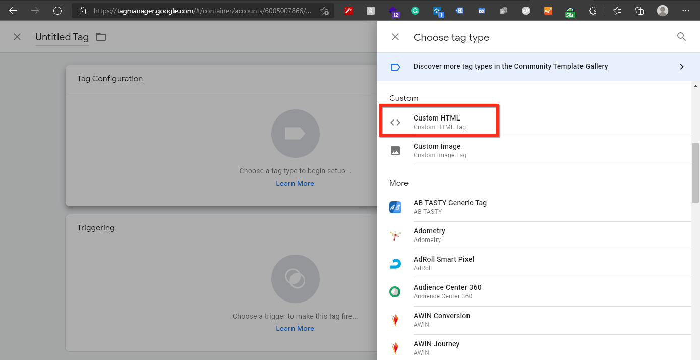
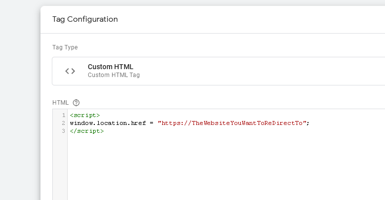

# Redirect Using Google Tag Manager

### Step 1 — Create a Custom HTML Tag



### Step 2 — Create a Custom HTML Tag
Paste the following script on Custom HTML Tag
```
<script>
window.location.href = "https://TheWebsiteYouWantToReDirectTo";
</script>

```



### Step 3 —  Save the tag and connect it with appropriate trigger

### Step 4 —  Submit the changes

### Step 5 —  Test the entire flow.
